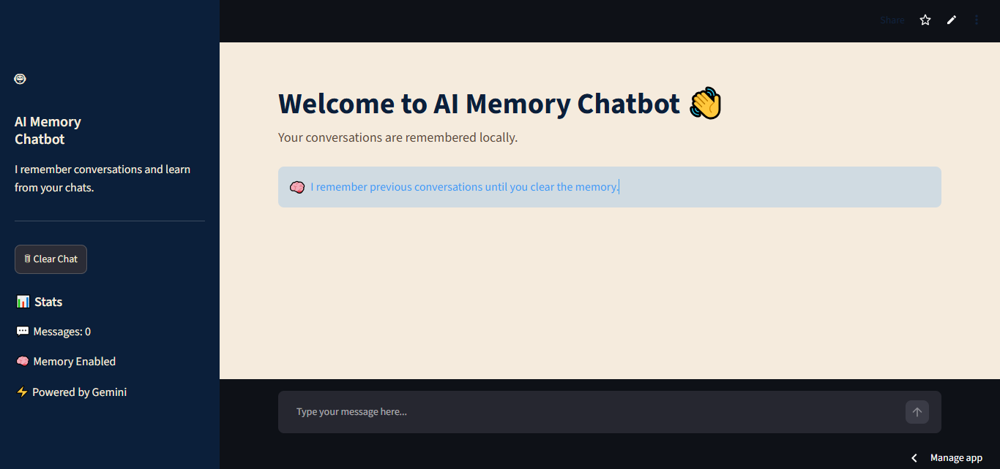
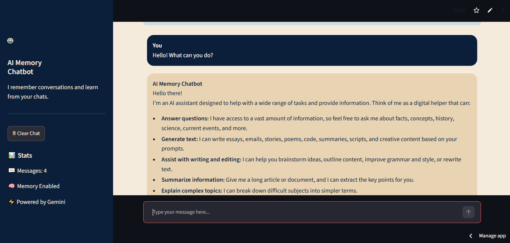
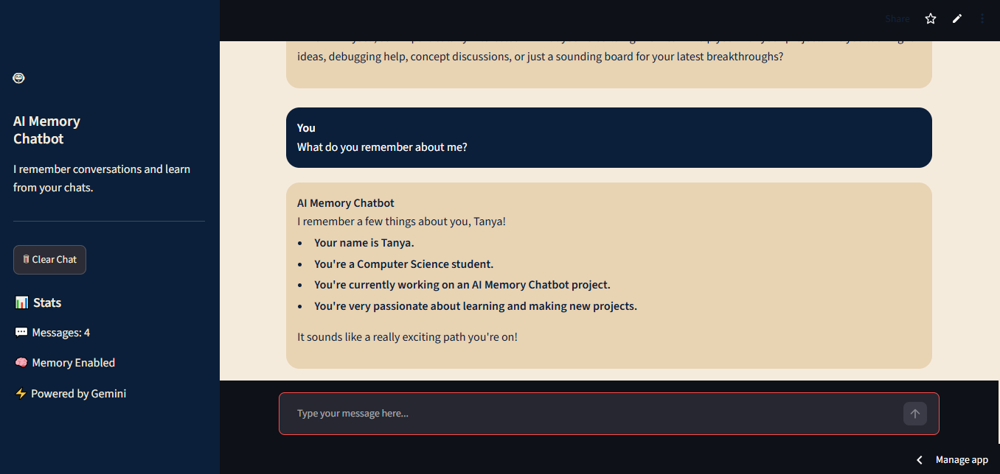
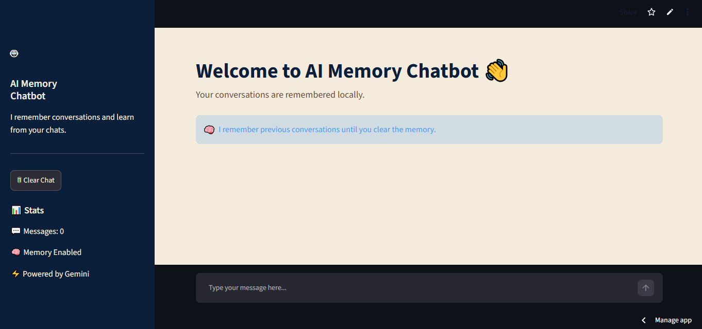
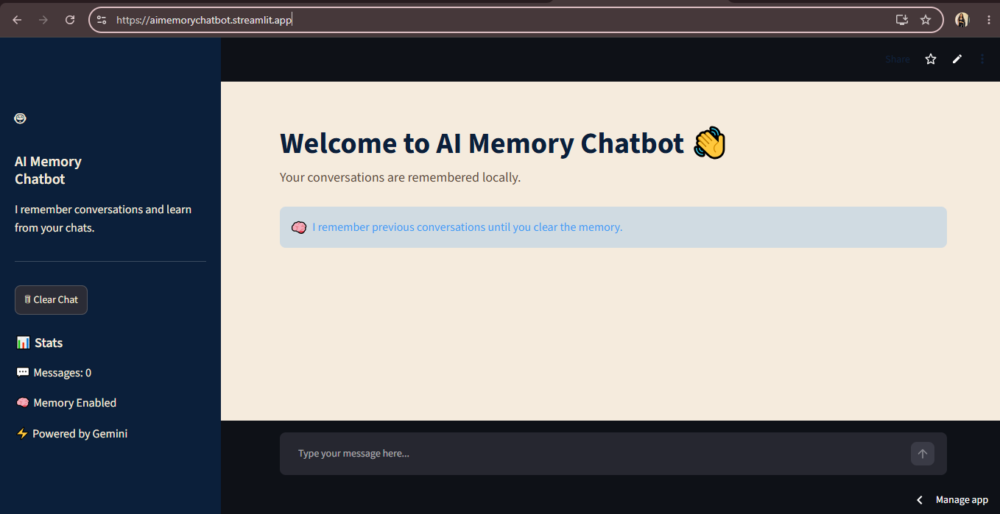

# 🤖 AI Memory Chatbot

> **Project 1 – DecodeLabs Internship**

An AI-powered chatbot built using **Python**, **Streamlit**, and **Google Gemini API** that provides intelligent conversations while maintaining local conversation memory for context-aware responses.

---

## 🌐 Live Demo

🚀 **Live Application:**  
https://aimemorychatbot.streamlit.app/

📂 **Repository:**  
https://github.com/yadavtanya717-dev/-DecodeLabs-Internship

## 🎥 Demo Video

Watch the complete project demonstration on YouTube:

[](<https://youtu.be/sz0mnUZZWUQ>)

Or click here:

<https://youtu.be/sz0mnUZZWUQ>


---

## 📖 Project Overview

The **AI Memory Chatbot** is an intelligent conversational assistant that remembers previous interactions during a session to provide more relevant and contextual responses.

Unlike a basic chatbot, this application stores conversation history locally and sends the previous context to Google's Gemini model, enabling more natural and personalized conversations.

The chatbot features a modern custom interface with a navy blue and beige theme, secure API key management, and cloud deployment using Streamlit Community Cloud.

---

## ✨ Features

- 🤖 AI-powered conversations using Google Gemini
- 🧠 Conversation memory using local JSON storage
- 💬 Context-aware responses
- 🎨 Modern custom Streamlit interface
- 📁 Local memory management
- 🔐 Secure API key handling using environment variables
- ☁️ Cloud deployment with Streamlit Community Cloud
- ⚡ Fast and responsive user experience

---

# 🖼️ Application Preview

## 🏠 Home Screen



---

## 💬 AI Conversation



---

## 🧠 Memory Demonstration



---

## 🗑️ Clear Chat Feature



---

## 🌍 Live Deployment



---

# 🛠️ Technology Stack

| Category | Technology |
|-----------|------------|
| Language | Python |
| Framework | Streamlit |
| AI Model | Google Gemini 2.5 Flash |
| SDK | google-genai |
| Environment Variables | python-dotenv |
| Data Storage | JSON |
| Version Control | Git |
| Repository | GitHub |
| Deployment | Streamlit Community Cloud |

---

# 📁 Project Structure

```text
Project-1-AI-Memory-Chatbot/
│
├── assets/
│   ├── home.png
│   ├── conversation.png
│   ├── memory-demo.png
│   ├── clear-chat.png
│   └── deployment.png
│
├── app.py
├── gemini_api.py
├── memory.py
├── requirements.txt
├── README.md
└── .gitignore
```

---

# ⚙️ Installation

Clone the repository

```bash
git clone https://github.com/yadavtanya717-dev/DecodeLabs-Internship.git
```

Move into the project directory

```bash
cd Project-1-AI-Memory-Chatbot
```

Create a virtual environment

```bash
python -m venv venv
```

Activate the virtual environment

### Windows

```bash
venv\Scripts\activate
```

### macOS/Linux

```bash
source venv/bin/activate
```

Install dependencies

```bash
pip install -r requirements.txt
```

---

# 🔑 Environment Variables

Create a `.env` file inside the project directory:

```env
API_KEY=YOUR_GEMINI_API_KEY
```

---

# ▶️ Run the Application

```bash
streamlit run app.py
```

---

# 🧠 How Memory Works

```text
User Message
      │
      ▼
Store Conversation in memory.json
      │
      ▼
Retrieve Previous Context
      │
      ▼
Send Context to Gemini API
      │
      ▼
Generate Context-Aware Response
      │
      ▼
Display AI Response
```

---

# 🚀 Deployment

The application is deployed using **Streamlit Community Cloud**.

Deployment process:

- Push project to GitHub
- Connect repository to Streamlit Community Cloud
- Configure environment secrets
- Deploy and test the application

---

# 📚 What I Learned

Through this project, I gained practical experience in:

- Building AI-powered applications with Python
- Integrating Google Gemini API
- Designing interactive Streamlit interfaces
- Managing environment variables securely
- Working with local JSON-based data storage
- Using Git and GitHub for version control
- Resolving Git merge conflicts
- Deploying applications on Streamlit Community Cloud
- Debugging deployment and runtime issues

---

# 🚀 Future Improvements

- SQLite or PostgreSQL database integration
- User authentication
- Multiple chat sessions
- Long-term conversation memory
- Voice input and speech synthesis
- Export chat history
- Dark/Light mode toggle
- Semantic search using vector databases
- Retrieval-Augmented Generation (RAG)

---

# 👩‍💻 Author

**Tanya Yadav**

Computer Science Student

Developed as **Project 1** during the **DecodeLabs Internship**.

---

# ⭐ Support

If you found this project interesting, consider giving this repository a ⭐ on GitHub.

---

# 📜 License

This project was developed for educational and internship purposes.
