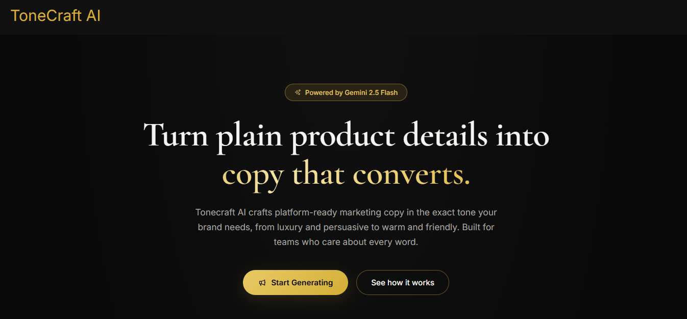
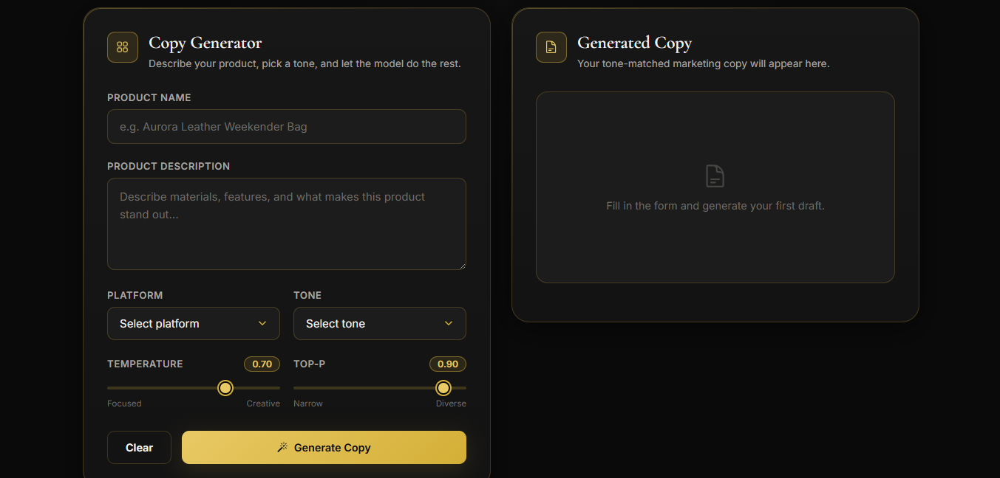
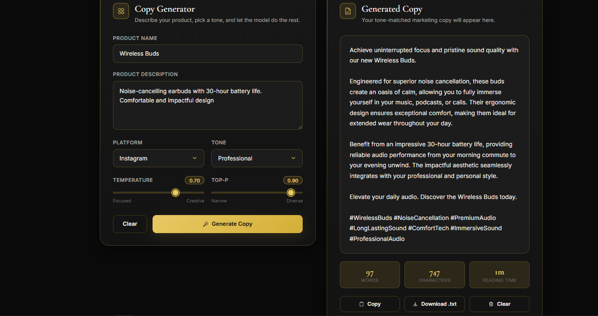
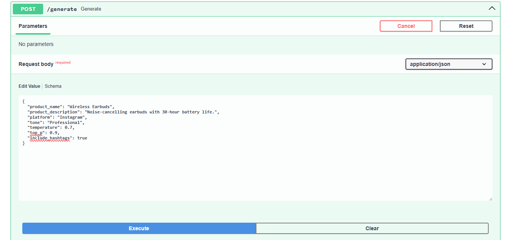
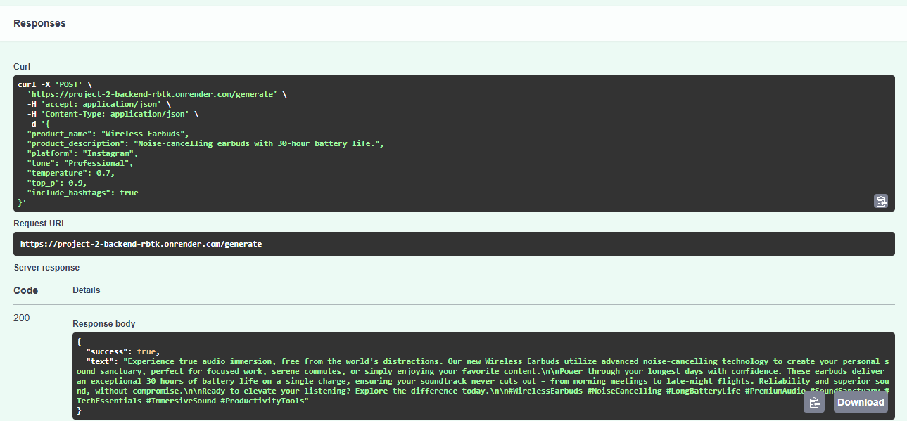

# 🚀 ToneCraft AI
## AI Copywriting & Tone Transformer

An AI-powered full-stack application that transforms simple product descriptions into compelling, platform-specific marketing copy using **Google Gemini AI**, **FastAPI**, and **React**.

---

## ⭐ Key Highlights

- 🤖 AI-powered marketing copy generation
- ✨ Dynamic prompt engineering
- 🎯 Platform-specific content generation
- 🎨 Multiple writing tones
- 🌡 Adjustable AI creativity (Temperature & Top-P)
- 📋 Copy generated content
- 📥 Download generated copy
- ⚡ FastAPI REST API
- 📚 Interactive Swagger Documentation
- 🌐 Fully deployed using Vercel & Render

---

# 🌐 Live Demo

### Frontend
https://ai-tone-transformer.vercel.app

### Backend API
https://project-2-backend-rbtk.onrender.com

### Swagger Documentation
https://project-2-backend-rbtk.onrender.com/docs

---

# 📖 Project Overview

ToneCraft AI is a full-stack Generative AI application designed to help users create professional marketing copy in seconds.

Users provide a product name, product description, target platform, and preferred writing tone. The backend dynamically constructs an optimized prompt and sends it to Google Gemini AI. The generated response is then displayed through a modern React interface, where users can easily copy or download the content.

This project demonstrates prompt engineering, REST API development, frontend-backend integration, AI inference parameter tuning, and cloud deployment.

---

# ✨ Features

- AI-powered marketing copy generation
- Dynamic prompt construction
- Platform-specific content generation
  - Instagram
  - LinkedIn
  - Email
  - Facebook
- Multiple writing tones
  - Professional
  - Luxury
  - Friendly
  - Persuasive
  - Humorous
- Adjustable AI creativity
  - Temperature
  - Top-P
- Optional hashtag generation
- Copy generated content
- Download generated content
- Responsive React interface
- FastAPI backend
- Interactive Swagger API documentation

---

# 🖼 Project Screenshots

## 🏠 Homepage



---

## ✍️ Copy Generator



---

## 📄 Generated Marketing Copy



---

## ⚙️ Swagger API Request



---

## ✅ Swagger API Response



---

# 🧠 Prompt Engineering

The backend dynamically builds prompts using user inputs including:

- Product Name
- Product Description
- Target Platform
- Writing Tone
- Temperature
- Top-P
- Hashtag Preference

This enables Google Gemini AI to generate marketing content that is context-aware, platform-specific, and aligned with the selected writing style.

---

# 🏗 System Architecture

```
                    User
                      │
                      ▼
            React Frontend (Vercel)
                      │
              HTTP POST Request
                      │
                      ▼
           FastAPI Backend (Render)
                      │
          Dynamic Prompt Builder
                      │
                      ▼
        Google Gemini 2.5 Flash API
                      │
          AI Generated Marketing Copy
                      │
                      ▼
      Copy • Download • User Interface
```

---

# 🛠 Tech Stack

## Frontend

- React
- Vite
- Axios
- CSS3

## Backend

- Python
- FastAPI
- Uvicorn
- Pydantic

## Artificial Intelligence

- Google Gemini 2.5 Flash API

## Deployment

- Vercel
- Render

---

# 📂 Project Structure

```
Project-2-AI-Copywriting-And-Tone-Transformer
│
├── assets
│   ├── homepage.png
│   ├── generator-form.png
│   ├── generated-copy.png
│   ├── swagger-request.png
│   └── swagger-response.png
│
├── frontend
│   ├── public
│   ├── src
│   ├── package.json
│   └── vite.config.js
│
├── app.py
├── gemini_api.py
├── prompt_builder.py
├── requirements.txt
├── .gitignore
└── README.md
```

---

# ⚙️ Installation

## Clone Repository

```bash
git clone https://github.com/yadavtanya717-dev/-DecodeLabs-Tasks.git
```

---

## Backend Setup

```bash
cd Project-2-AI-Copywriting-And-Tone-Transformer

python -m venv venv

venv\Scripts\activate

pip install -r requirements.txt

uvicorn app:app --reload
```

Backend:

```
http://127.0.0.1:8000
```

Swagger:

```
http://127.0.0.1:8000/docs
```

---

## Frontend Setup

```bash
cd frontend

npm install

npm run dev
```

Frontend:

```
http://localhost:5173
```

---

# 🔐 Environment Variables

Create a `.env` file inside the backend directory.

```env
GEMINI_API_KEY=YOUR_GEMINI_API_KEY
```

---

# 📡 API Endpoint

## Generate Marketing Copy

### POST

```
/generate
```

### Sample Request

```json
{
  "product_name": "Wireless Earbuds",
  "product_description": "Noise-cancelling earbuds with 30-hour battery life.",
  "platform": "Instagram",
  "tone": "Professional",
  "temperature": 0.7,
  "top_p": 0.9,
  "include_hashtags": true
}
```

### Sample Response

```json
{
  "success": true,
  "text": "Experience premium sound with our Wireless Earbuds. Enjoy crystal-clear audio, advanced noise cancellation, and up to 30 hours of battery life. Elevate every moment with immersive listening. #WirelessEarbuds #Tech #Innovation"
}
```

---

# 💡 Skills Demonstrated

### AI & Prompt Engineering

- Google Gemini API Integration
- Dynamic Prompt Construction
- Temperature & Top-P Tuning

### Backend Development

- FastAPI
- REST API Development
- Pydantic
- CORS Configuration

### Frontend Development

- React
- Vite
- Axios
- Responsive UI Design

### Deployment & Tools

- Git & GitHub
- Render
- Vercel
- Environment Variable Management

---

# 🚀 Future Improvements

- User Authentication
- Saved Copy History
- Brand Voice Profiles
- Multi-language Support
- Multiple AI Model Support
- PDF & Word Export
- AI Content Analytics
- One-click Social Media Publishing

---

# 👩‍💻 Author

**Tanya Yadav**

### GitHub

https://github.com/yadavtanya717-dev

### LinkedIn

https://www.linkedin.com/in/tanya-yadav-793b72384/

---

## 🎓 Internship

This project was developed as part of the **DecodeLabs AI Internship** to demonstrate practical skills in **Generative AI, Prompt Engineering, Full-Stack Development, API Integration, and Cloud Deployment**.